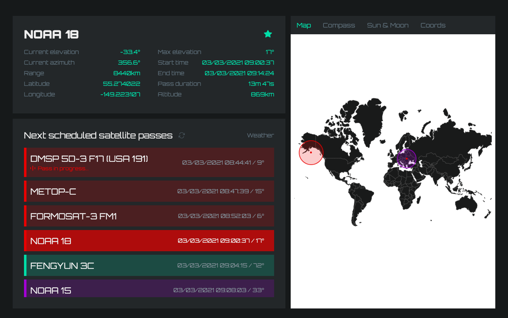
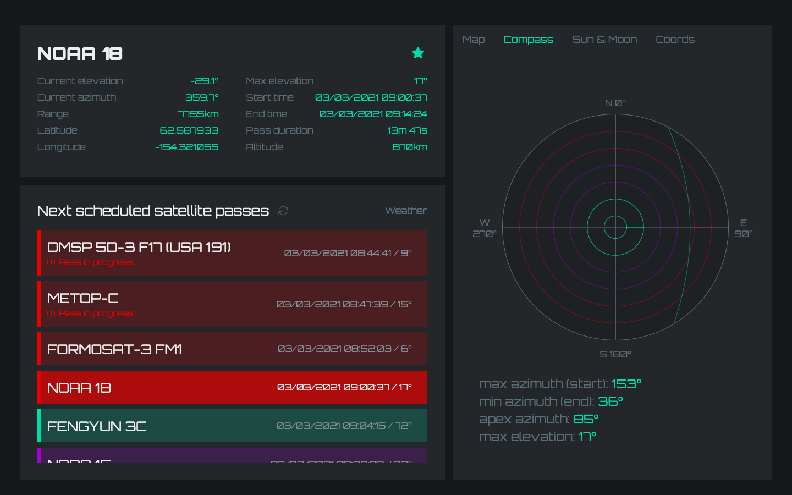
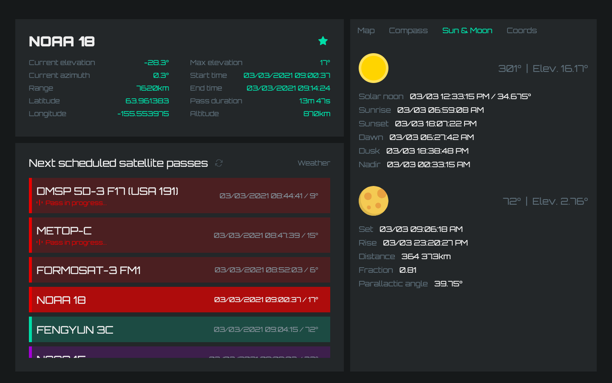
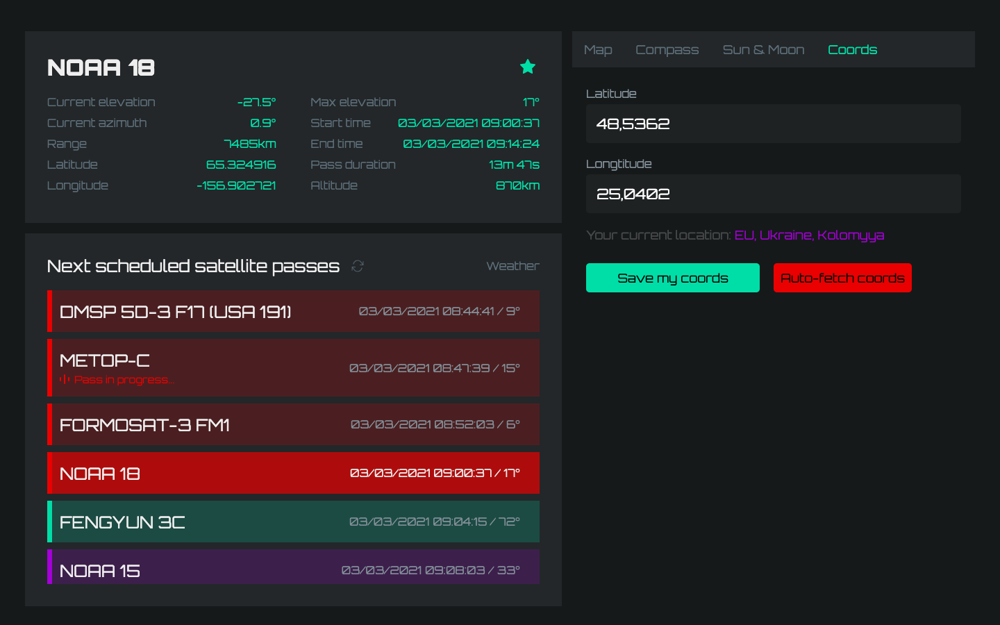

# Satellite predictor

## Build Setup

``` bash
# install dependencies
yarn

# runs an electron instance & vue
yarn dev

# build for production with minification
yarn electron:build

# App data is being saved in Documents folder (path depends on the system you're using)
```

> Map section


> Compass section (pass elevation and direction)


> Sun & moon section


> User coords section



Author of app icon: [Freepik](https://www.flaticon.com/authors/freepik)
